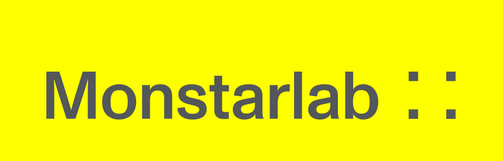

# SwiftUI-Template-MVVM
        
 [](https://swift.org)  


This template is intended to reduce the amount of time it takes to create and setup a new project with SwiftUI. 

It includes a sample project that contains:
* A MVVM Design Pattern (Model - View - ViewModel) with a subfolder for each category,
* Sample views
  * LoginView
  * SettingsView
  
  Feel free to clone this template and to reuse it!

  XCode, target iOS 14
  
#### Feature included:

##### Modifier
- Font Modifier, Rotation Modifier

##### Popup
- LoadingView, ToastView

##### Localize

- Multi-language(en, vi)

##### Utility
- View ext
- Console log (with Logger)
- User notification services(Local notification & Remote Notification)
- Define color, font

### Prerequisites:
* [Cookiecutter](https://cookiecutter.readthedocs.io/en/latest/README.html)

Install cookiecutter by runing below terminal command.

```
brew install cookiecutter
```

## What's in the template?

 - Configures the project name, company name, lead name, an initial local repo, gitignore.

## Usage

The project template uses Cookiecutter to create your project from it. Run below command to create your project from this template:

```
cookiecutter gh:monstar-lab-consulting/mvn-arch-swiftui-ios
```

Give your desire app name then your company name. Thats it, you should be able to see your app directory created based on this template!
